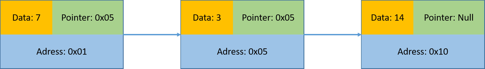
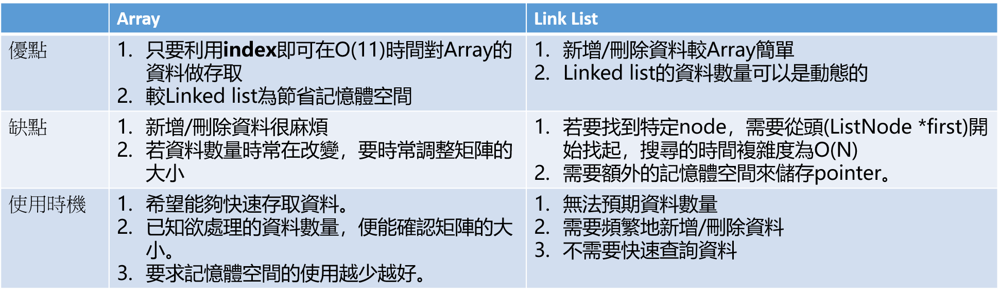

# Data structure
## Data types
- Array: 表示一塊緊密相連的記憶體位置<p>
  1. 一維陣列<p>
  ```c
  //c
  int score[5] = {1, 2, 3, 4, 5};
  ```
  2. 二維矩陣<p>
  ```c
  //c
  int number[2][3] = {{1, 2, 3}, 
                      {4, 5, 6}};
  ```
  3. 三維矩陣<p>
  ```c
  //c
  int number[2][3][3] = {{{11, 11, 11}, 
                          {12, 12, 12},
                          {13, 13, 13}},
                          {21, 21, 21}, 
                          {22, 22, 22},
                          {23, 23, 23}}}
  ```
- Linked List: 由許多相同資料型態的項目，依照特定順序排列而成的線性串列，在記憶體中是不連續、隨機的方式儲存。對資料的刪除、插入是直接對記憶體處理，相當快速。<p>
Tips: node(節點)來記錄、表示、儲存資料(data)，每個node中的pointer指向下一個node。<p>
See sample [linkList.c](linkList.c)<p>


- Stack
- Queue

## Tree
## Hash Table
## Compares
- Array & Link list
Note: Compare array & link list<p>



- 156165 