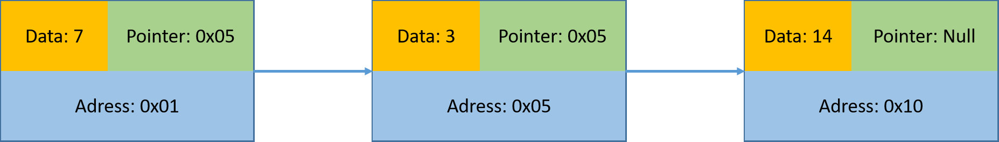
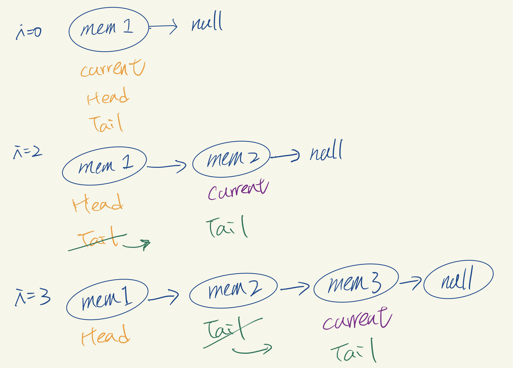
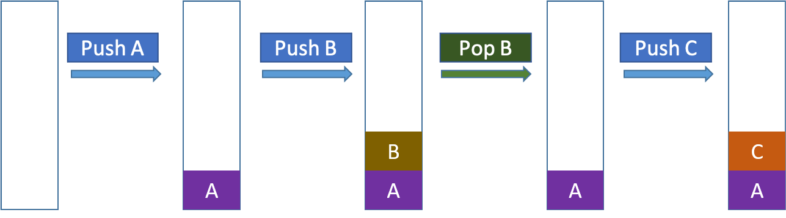
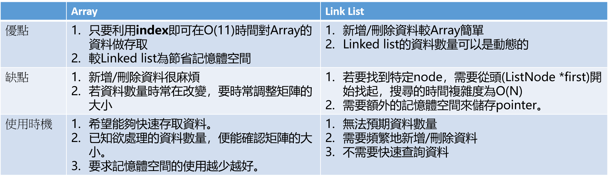

# Data structure
## Data types
- Array: 表示一塊緊密相連的記憶體位置<p>
  1. 一維陣列<p>
  ```c
  int score[5] = {1, 2, 3, 4, 5};
  ```
  2. 二維矩陣<p>
  ```c
  int number[2][3] = {{1, 2, 3}, 
                      {4, 5, 6}};
  ```
  3. 三維矩陣<p>
  ```c
  int number[2][3][3] = {{{11, 11, 11}, 
                          {12, 12, 12},
                          {13, 13, 13}},
                          {21, 21, 21}, 
                          {22, 22, 22},
                          {23, 23, 23}}}
  ```
- Linked List: 由許多相同資料型態的項目，依照特定順序排列而成的線性串列，在記憶體中是不連續、隨機的方式儲存。以node(節點)來記錄、表示、儲存資料(data)，每個node中的pointer指向下一個node。<br>
  <p>
  Tips: 實作上可參考範例程式碼，邏輯如下圖:<br>
  
  Tips: **需要記住head node，以遍歷方式對所有串列操作**<br>

- Stack: 是一種後進先出(Last In, First Out, LIFO)的資料結構。其特性如下:<br>
   <br>
  Refer: https://www.cs.usfca.edu/~galles/visualization/StackArray.html <p>
  實作上，也可以搭配鏈結串列製作堆疊，概念如下: <br>
  
  Tips: **需要記住堆疊頂部位置，陣列則為top index，Node指標則為top memory**<br>


- Queue

## Tree
## Hash Table
## Compares
- Array & Link list
Note: Compare array & link list<p>



- 156165 

## Samples
- Linked List<p>
Refer: https://lakesd6531.pixnet.net/blog/post/329288496
1. 靜態記憶體搭建鏈結串列: [linkList.c](linkList.c)
2. 動態記憶體搭建鏈結串列: [linkList02.c](linkList02.c), [linkList02.cpp](linkList02.cpp)
3. 鏈結串列動態建立與釋放: [linkList03.c](linkList03.c), [linkList03.cpp](linkList03.cpp)
4. 節點的搜尋與插入: [linkList04.c](linkList04.c), [linkList04.cpp](linkList04.cpp)
5. 節點的刪除: [linkList05.c](linkList05.c), [linkList05.cpp](linkList05.cpp)

- Stack<p>
Refer: https://lakesd6531.pixnet.net/blog/post/332858496 <br>
Refer: https://reurl.cc/DyglNE
1. 使用陣列製作堆疊: [stack01.c](stack01.c)
2. 使用鏈結串列製作堆疊: [stack02.c](stack02.c), [stack02.cpp](stack02.cpp)
3. 利用堆疊判斷輸入左右括號是否匹配: [stack03.cpp](stack03.cpp)